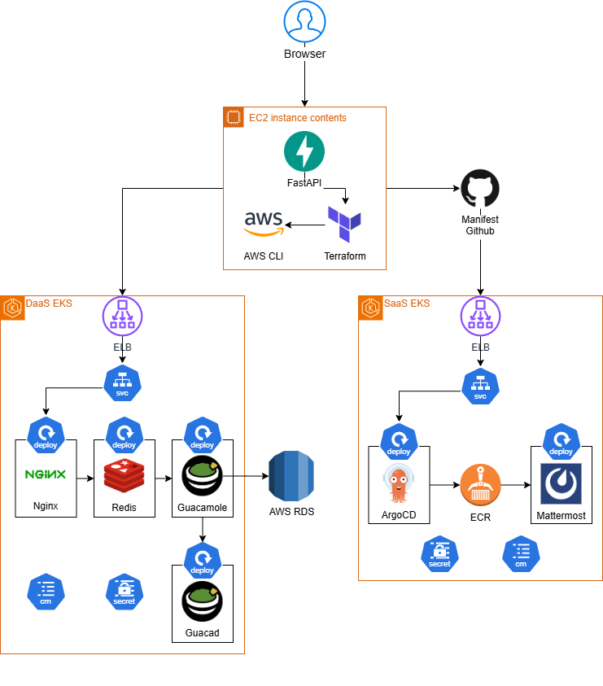
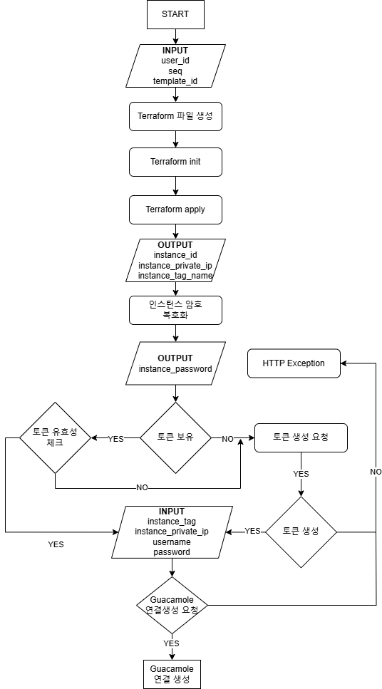
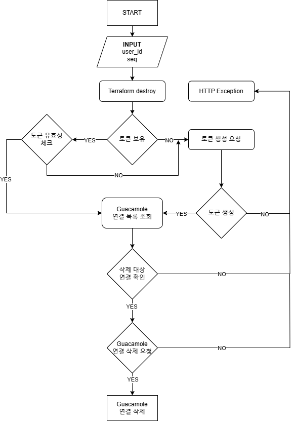
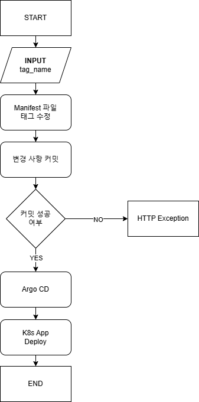
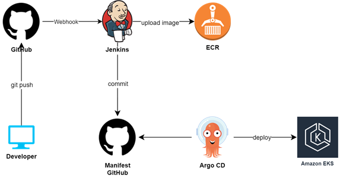

# DaaS 환경 내 SaaS 애플리케이션 운영 관리를 위한 플랫폼 구축(백엔드)

## 프로젝트 설명
DaaS(Desktop as a Service) 환경에서 SaaS(Software as aService) 애플리케이션을 배포하고
이를 운영 및 관리하기 위한 통합 플랫폼 구축

## 목표 및 기능 
1. DaaS 구축을 위한 API 구현
2. SaaS 버전 관리를 위한 API 구현

## 기술 스택
Apache Guacamole==1.5.5 
Python==3.10.12 
fastapi==0.112.1 
uvicorn==0.30.6 
httpx==0.27.0 
pydantic==2.8.2 
PyGithub==2.4.0 
PyYAML==5.4.1 
Terraform-CLI==1.9.5 
AWS-CLI==2.17.37 

## 플로우 차트
### Backend

### DaaS Connection Create

### DaaS Connection Delete

### SaaS Version Control

### Backend CI/CD

## 문의 
meteo0718@gmail.com